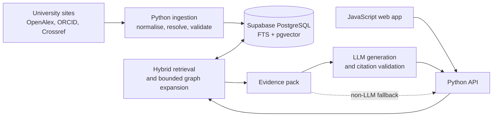

## High-level architecture

**Implementation status:** The provider-neutral Python GraphRAG module under `src/academic_graphrag` now implements in-memory adapters, BM25 and mock dense retrieval, RRF, bounded graph expansion, replaceable reranking, configurable academic ranking, evidence selection, structured generation context, and insufficient-information handling. The HTTP API, Supabase adapter, production embedding/reranking model, LLM generation, and deployment configuration remain future work.

| Component | Responsibility |
|---|---|
| JavaScript frontend | Search, filters, profiles, answers, citations, loading/error/empty states |
| GraphRAG Python module | Retrieval orchestration, bounded expansion, ranking, evidence selection, response shaping |
| Python HTTP API | Future request validation and transport layer |
| Ingestion workers | Source fetching, caching, normalisation, identity resolution, embedding, retry |
| Supabase PostgreSQL | Canonical records, provenance, full-text indexes, vectors, and relationship queries |
| LLM provider | Generates answers only from the server-supplied evidence pack |

FastAPI and Pydantic are recommended for the Python API because they provide a small, typed boundary. The frontend framework and managed Python host may be selected by the team without changing the design.

This separation preserves the project's MVC intent: the web client owns presentation, API controllers coordinate requests, and Python domain/repository services own retrieval and data access.

## Academic data model

Use normalised, typed tables as the source of truth rather than a generic node/edge JSON store.

### Core entities

| Entity | Key fields |
|---|---|
| `Researcher` | UUID, names, position, profile URL, ORCID/OpenAlex aliases |
| `Publication` | UUID, title, year, abstract, DOI/OpenAlex aliases |
| `Institution` | UUID, name, ROR/domain, selected-university flag |
| `Topic` | UUID, label, provider/taxonomy identifier |
| `SourceRecord` | provider, source URL/ID, observed time, content hash, licence, raw snapshot reference |
| `Evidence` | supported entity/relationship, source record, excerpt/field locator, confidence |

### Canonical relationships

- `Researcher -AUTHORED-> Publication`
- `Publication -CITES-> Publication`
- `Researcher -AFFILIATED_WITH-> Institution`
- `Publication -ABOUT-> Topic`
- `SourceRecord -SUPPORTS-> Evidence`

Co-authorship and researcher-topic links are derived from these facts. They should not be stored as duplicate canonical data. A read-only `graph_edges` database view may expose a uniform graph shape for retrieval while typed tables remain authoritative.

All internal IDs are immutable UUIDs. External IDs such as ORCID, DOI, OpenAlex, and ROR are unique aliases, not primary keys.

## Ingestion, identity, and provenance

Each source uses an adapter that fetches data into a raw cache before normalisation. Jobs are resumable and idempotent so API failures or rate limits do not require a complete restart.

Source priority is field-specific:

1. Official university pages for current position, affiliation, and official profile.
2. ORCID and OpenAlex for researcher identifiers and publication linkage.
3. Crossref for DOI and publication metadata enrichment.

Identity resolution follows a fail-closed order:

1. Match verified ORCID.
2. Match provider identifiers such as OpenAlex.
3. Match an official profile with corroborating affiliation and publication evidence.
4. Record heuristic name-based candidates for review; never merge people by name alone.

Resolution states are `exact`, `resolved`, `probable`, and `unresolved`. Only `exact` and reviewed `resolved` identities may support confident cross-source claims. Conflicts are preserved with their source and observation date rather than silently overwritten.

## GraphRAG retrieval pipeline

GraphRAG runs as a bounded extension of hybrid search:

1. **Interpret:** extract query text, universities, disciplines, people, date ranges, and identifiers.
2. **Retrieve seeds:** run exact identifier/name lookup, PostgreSQL full-text search, pgvector similarity search, and structured filters.
3. **Fuse:** combine ranked lists using Reciprocal Rank Fusion (RRF), avoiding incomparable raw-score weighting.
4. **Expand:** execute approved one- or two-hop SQL paths, for example researcher -> publication -> topic or researcher -> publication <- researcher.
5. **Rank evidence:** consider text relevance, semantic similarity, source authority, recency, relationship confidence, and path length.
6. **Build an evidence pack:** include only the highest-value entities, paths, excerpts, and server-issued evidence IDs.
7. **Generate and validate:** ask the LLM to cite evidence IDs, then reject unsupported claims or invalid citations.

Server-side budgets limit entities, paths, excerpts, tokens, and high-degree citation/co-author fan-out. The MVP should use explicit SQL functions for approved paths, not generic breadth-first search. This is easier to test and prevents popular researchers from overwhelming results.

If the LLM is unavailable, the API returns ranked researchers, publications, relationship paths, and source excerpts. If the evidence threshold is not met, it returns `insufficient_information` with the best available sources, if any.

## Answer and citation contract

The LLM receives no unrestricted database access. Its input is a bounded evidence pack containing:

- stable evidence IDs;
- source title, URL, provider, and observed date;
- short excerpts or structured facts;
- relevant graph paths and confidence states.

The output schema contains an answer status, claims, cited evidence IDs, and related entities. A server-side validator must reject:

- claims with no evidence ID;
- unknown or duplicated citation IDs;
- citations that do not support the associated claim;
- claims based only on `probable` or `unresolved` identity links;
- confident answers when evidence coverage is below the configured threshold.

Citations are displayed next to the claim they support and link to the original public source. AI explanation and source-supported facts must be visually distinguishable.

## API and user experience

Minimal API surface:

- `GET /search` - hybrid search with university, discipline, topic, and name filters.
- `GET /researchers/{id}` - sourced profile, publications, relationships, and summary.
- `POST /questions` - evidence-grounded answer with inline citation metadata.
- `GET /sources/{id}` - provenance and original-source link.
- `GET /health` - service and dependency health without secret disclosure.

The interface should support one clear search/question entry point, filterable results, readable profiles, citation expansion, and explicit loading, empty, error, conflict, and insufficient-evidence states. It must remain usable on common desktop and smaller screens with keyboard navigation and basic accessibility labels.

## Security, privacy, and deployment

- Store only public professional and academic information.
- Keep Supabase service credentials, LLM keys, and ingestion credentials on the backend.
- Apply row-level security to any user-owned data; expose academic records through controlled read APIs.
- Rate-limit question answering and cap LLM/retrieval cost per request.
- Record request IDs, retrieval versions, evidence IDs, model configuration, and validation outcomes without logging secrets or unnecessary personal data.
- Deploy the frontend to Vercel, PostgreSQL/pgvector to Supabase, and the Python API/workers to a managed host independent of a team member's computer.

## Validation and delivery plan

| Area | Minimum validation |
|---|---|
| Data | Schema constraints, adapter fixtures, idempotent reruns, duplicate/conflict cases |
| Retrieval | Frozen client queries; Recall@K, nDCG@K, filter correctness, path-budget tests |
| Grounding | Claim support rate, citation precision, invalid-citation rejection, insufficient-information tests |
| Product | Search/profile/question end-to-end tests, accessibility checks, responsive UI checks |
| Operations | Deployment smoke test, secret/configuration check, backup/restore and ingestion-resume test |

The flat retrieval path must remain available throughout delivery. It reduces schedule risk and provides a measurable baseline for deciding whether GraphRAG improves relevance and groundedness.

## Suggestions from me

- Use PostgreSQL plus `pgvector`; do not add a separate graph database for the MVP.
- Keep typed relational tables authoritative; expose a graph view only for read-time traversal.
- Derive co-authorship and researcher-topic links rather than duplicating them.
- Use hybrid retrieval plus RRF before graph expansion.
- Limit traversal to approved one- and two-hop paths.
- Treat provenance, identity confidence, and citation validation as correctness requirements.
- Prefer `insufficient_information` to any unsupported answer.
