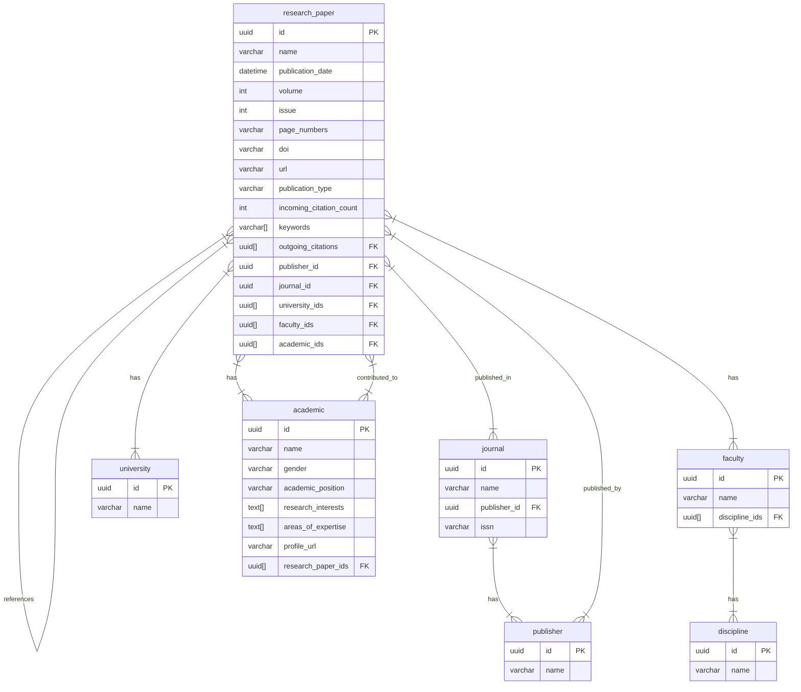

```mermaid
erDiagram

    faculty         |{--|{ discipline : has
    journal         |{--|{ publisher : has
    research_paper  |{--|{ research_paper : references
    research_paper  |{--|{ publisher : published_by
    research_paper  |{--|{ journal : published_in
    research_paper  |{--|{ university : has
    research_paper  |{--|{ faculty : has
    research_paper  |{--|{ academic : has
    academic        |{--|{ research_paper : contributed_to

    university {
        uuid id PK
        varchar name
    }

    faculty {
        uuid id PK
        varchar name
        uuid[] discipline_ids FK
    }

    discipline {
        uuid id PK
        varchar name
    }

    publisher {
        uuid id PK
        varchar name
    }

    journal {
        uuid id PK
        varchar name
        uuid publisher_id FK
        varchar issn
    }

    research_paper {
        uuid id PK
        varchar name
        datetime publication_date
        int volume
        int issue
        varchar page_numbers
        varchar doi
        varchar url
        varchar publication_type
        int incoming_citation_count
        varchar[] keywords
        uuid[] outgoing_citations FK
        uuid publisher_id FK
        uuid journal_id FK
        uuid[] university_ids FK
        uuid[] faculty_ids FK
        uuid[] academic_ids FK
    }

    academic {
        uuid id PK
        varchar name
        varchar gender
        varchar academic_position
        text[] research_interests
        text[] areas_of_expertise
        varchar profile_url
        uuid[] research_paper_ids FK
    }
```
